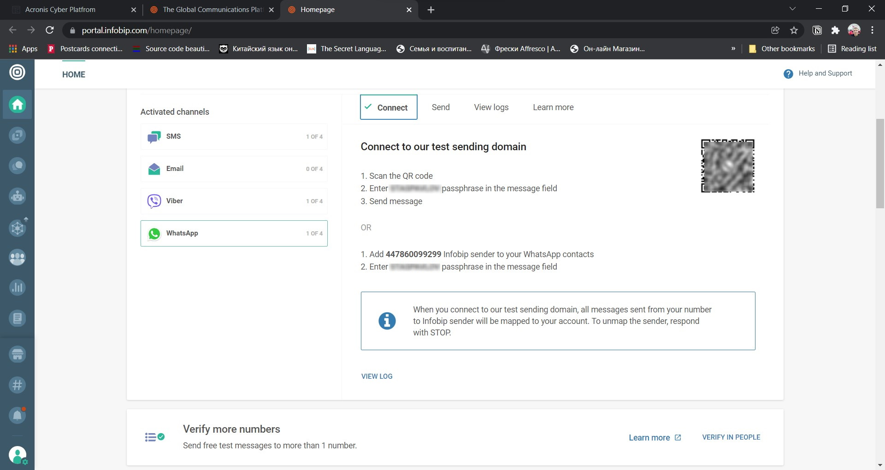
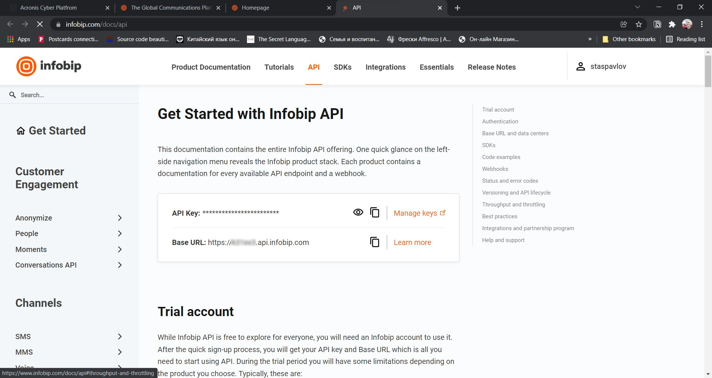
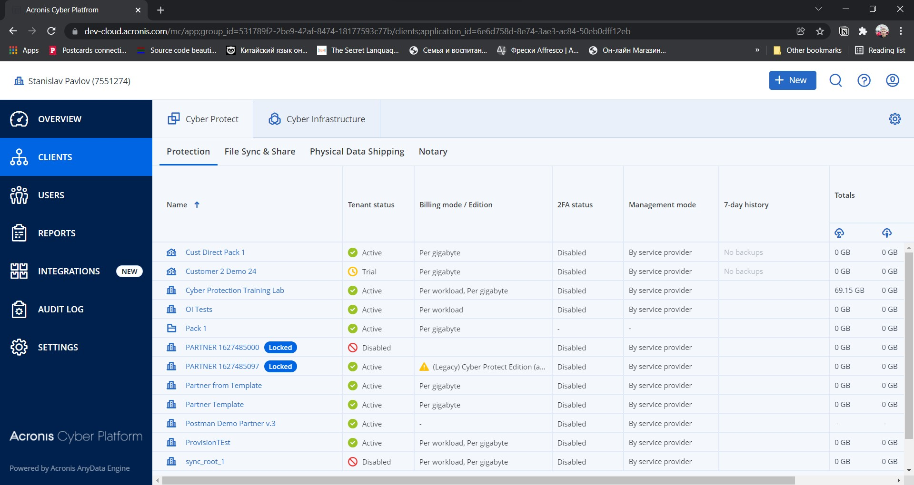
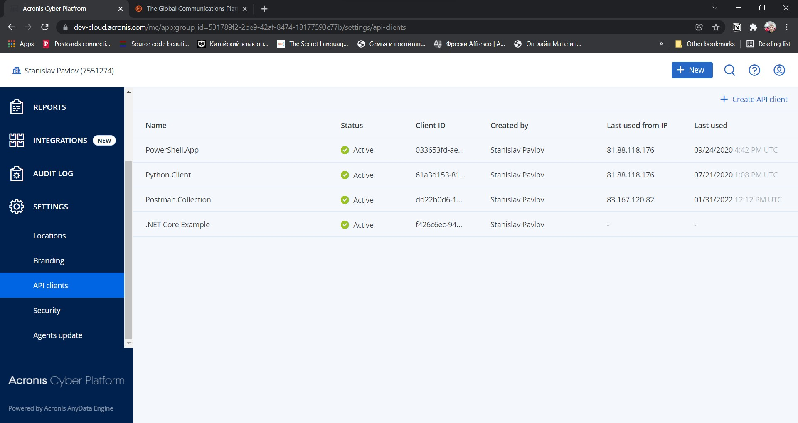
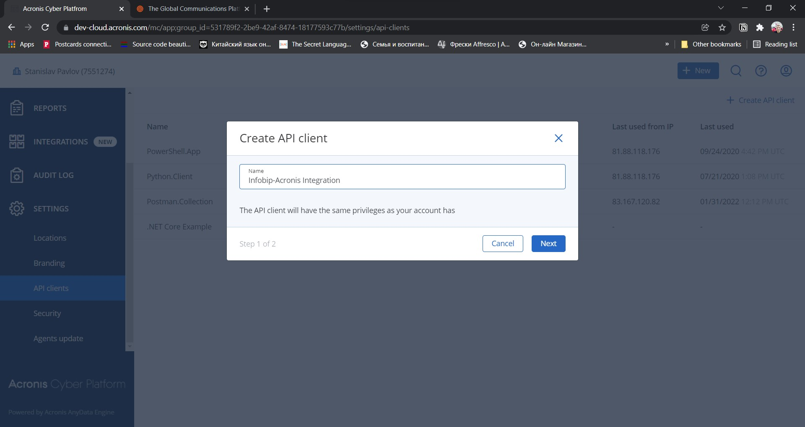
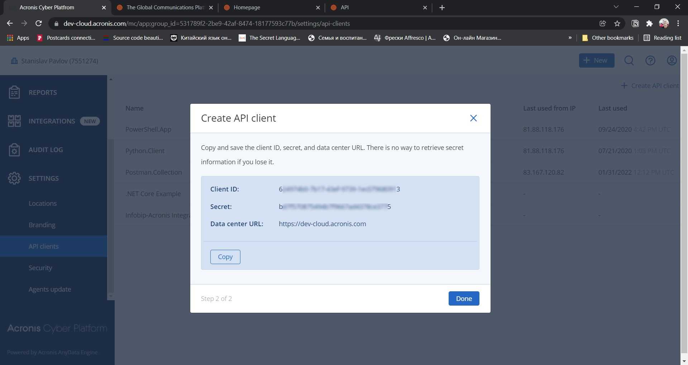

# Use Infobip Services to Enable Omnichannel Notifications for Acronis Cyber Protect Cloud Events

Having notification of something important at the proper time and place is very important. Especially if it's connected to services, you use to protect your IT environment. In this simple example, we look into how any service that supports API to retrieve events or statuses data can be extended with the Infobip suite of services.
As a notification source, we will use Acronis Cyber Protect Cloud as it provides a simple REST API to receive notifications. 

## Get Started

To run the example, you need to have Infobip and Acronis accounts. The great thing is that both services have free developer access to test and develop. If you still don't have any of those services, you need to register as a developer to run the sample.

### Get Started Infobip

Register at the https://www.infobip.com/docs/api page and connect to WhatsApp test sending domain as descibed at https://portal.infobip.com/homepage/.  


Login with your credentials, navigate to https://www.infobip.com/docs/api. Notice you Infobip base URL and API Key.


### Acronis

Register at the https://developer.acronis.com, confirm your e-mail and ONLY after that, navigate to the https://developer.acronis.com/sandbox page and activate you developer account for Acronis Cyber Protect Cloud.  

**Important**: To receive free account using this form you MUST use a e-mail which is never used to register for Acronis services.

Login to Acronis Cyber Protect Cloud and issue an API Client.
When you log in to Acronis Cyber Protect Cloud you see the Management Console.

At the left pane click **SETTINGS** and then **API Clients**

Click on **Create API Client** link at the top right corner and give a name to your API Client

Click **Next** button and notice you Client ID, Client Secret and base URL for Acronis API 


### The Example Initial Configuration

The example is fully confugurable through ``config.json`` file in the root folder. To have workable example you need to fill that file with your data. Initially the file is populated with Infobip testdomain data and Acronis dev-cloud base URL.

```json
{
    "infobip_base_url": "",
    "infobip_api_key": "",
    "acronis_base_url": "https://dev-cloud.acronis.com/",
    "acronis_client_id": "",
    "acronis_client_secret": "",
    "whats_app_from_number": "447860099299 ",
    "sms_from_number": "InfoSMS ",
    "viber_from_account": "DemoCompany",
    "to_notify":[
        ""
    ],
    "channel": "whatsapp-sms" 
}
```

Please, paste to the file your Infobip base URL edned with ``\`` and your Infobip API Key. As well, add Acronis client id and client secret. In ``to_notify``you can put list of numbers to send SMS, WhatsApp and Viber. However, during the trial in Infobip you can only send to the number you register with, so put the number you use to register with Infobit here.

``channel`` parameter is to configure the way you sent notification. There are four possible values supported: ``sms``, ``whatsapp``, ``whatsapp-sms``, ``viber-sms``. ``whatsapp-sms``, ``viber-sms`` are OMNI message scenarios. The system trys to send messages to a messenger and if fail, sends another simplified message by SMS.

``whats_app_from_number``, ``viber_from_account`` and ``sms_from_number`` are numbers/account used for ``from`` filed for your messages. The config file is already filled by test domain Infobip data for that fields.

***DON'T SHARE THE FILLED FILE, AS IT'S YOUR CREDENTIALS TO ACCESS Infobip AND Acronis**

## The Example Structure

The example consists of 2 Python files and 3 configuration JSON files
- ``main.py``
- ``common.py``
- ``config.json``
- ``scenarios/viber-sms.json``
- ``scenarios/whatsapp-sms.json``

``main.py`` is the main flow file, in which Acronis statues are requested, message composed and send depending on configuration.

```python
# Init helper classes
    cfg = Config()
    acronis = Acronis(cfg)
    infobip = Infobip(cfg)
    
    # Get most severe resource statuses
    response = acronis.get("api/alert_manager/v1/resource_status?embed_alert=true")
    
    # If success, iterate through statuses to create a message to send
    if response.ok:
       resources = response.json()["items"]
       msg = ""
       if len(resources)>0:
            for resource in resources:
               resource_id = resource["id"]
               severity = resource["severity"]
               type = resource["alert"]["type"]
               name = resource_id
               response = acronis.get(f"api/resource_management/v4/resources/{resource_id}")
               if response.ok:
                   name = response.json()["name"]
               msg = msg + f"Resource: {name}\n\rSeverity: {severity}\n\rType: {type}\r\n###\r\n"
            
            # message to send through failover channel
            failover_msg = f"You have severe {len(resources)} alerts."
            
            # send notifcation to list of persons from config.json using selected channel in config.json
            if cfg.channel == "sms":
                infobip.send_sms_message(failover_msg)
            elif  cfg.channel == "whatsapp":
                infobip.send_whatsapp_message(msg)
            elif  cfg.channel == "whatsapp-sms":
                infobip.send_omni_whatsapp_sms_message(msg,failover_msg)
            elif  cfg.channel == "viber-sms":
                infobip.send_omni_viber_sms_message(msg, failover_msg)
            else:
                infobip.send_omni_viber_sms_message(msg, failover_msg)
    else:
        print("Can't retrieve alerts infomation!")
```

Acronis APIs support only pull type of request for events, no callbacks, so this script can be used together with any scheduler to receive periodical updates regarding protection status.

The main code use helper classes fron ``common.py``: ``Config``, ``Infobip`` and ``Acronis``.
``Config`` instance represent all needed configuration information to successfully call Infobip and Acronis API.
``Infobip`` instance reporeset base REST method calls togther with some more functional API as well as some initialisation routine. ``Acronis`` instance represent very base class wrapper with base REST method calls.

Let's look how ``Infobip`` class is initialized

```python
def __init__(self, cfg: Config):
        self.__cfg = cfg
        self.__auth = APIKeyAuth(self.__cfg.infobip_api_key)
        self.__ensure_omni_scenarios_exists()
```

It stores a ``Config`` instance an API key and check if in the used Infopip accounts 2 pre-defined scenarios exists.

```python
 # Check if scenarios with pre-defined names exist
# If there are no scenarios, they will be created
# Scenarios is created is only once
def __ensure_omni_scenarios_exists(self):
    response = self.get("omni/1/scenarios")
    
    if response.ok:
        viber_scenario = [scenario for scenario in response.json()["scenarios"] if scenario["name"] == 'acronis-infobip-viber-sms-omni']
        
        if len(viber_scenario)>0:
            self.__scenarios['acronis-infobip-viber-sms-omni'] = viber_scenario[0]["key"]
        else:
            response = self.__create_viber_sms_onmi_scenario()
            self.__scenarios['acronis-infobip-viber-sms-omni'] = response.json()["key"]
            
        whatsapp_scenario = [scenario for scenario in response.json()["scenarios"] if scenario["name"] == 'acronis-infobip-whatsapp-sms-omni']
        
        if len(whatsapp_scenario)>0:
            self.__scenarios['acronis-infobip-whatsapp-sms-omni'] = whatsapp_scenario[0]["key"]
        else:
            response = self.__create_whatsapp_sms_onmi_scenario()
            self.__scenarios['acronis-infobip-whatsapp-sms-omni'] = response.json()["key"]
```

In our example integration we use 2 omni scenarios WhatsApp with SMS and Viber with SMS. To send an OMNI messagy we need to have a scenario to be registered and to know that scenario ``key``. We store our scenarios template JSONs in 2 files ``scenarios/viber-sms.json`` and ``scenarios/whatsapp-sms.json`` and expect that they have pre-defined names ``acronis-infobip-whatsapp-sms-omni`` and ``acronis-infobip-whatsapp-sms-omni``. This function check if these scenarios exists and if not, creates new ones.

As we already have scenario templates we only need to fill missing fileds: scenario name and sender data.

```python
# Create Viber+SMS OMNI scenario
def __create_viber_sms_onmi_scenario(self):
    self.__cfg.omni_viber_scenario["name"] = 'acronis-infobip-viber-sms-omni'
    viber_flow = [flow for flow in self.__cfg.omni_viber_scenario["flow"] if flow["channel"] == 'VIBER']
    viber_flow[0]["from"] =  self.__cfg.viber_from_account
    response = self.post("omni/1/scenarios", data=json.dumps(self.__cfg.omni_viber_scenario))
    return response
```

The function for WhatsApp omniscenario creation is near the same.

Let's look to a function we use to send messages.

```python
# Send an OMNI message Viber+SMS to all persons from to_notify array in config.json
def send_omni_viber_sms_message(self, msg: str, failover_msg: str):

    omni_responses = []

    for number in self.__cfg.to_notify:

        omni_msg = {
            "scenarioKey": f"{self.__scenarios['acronis-infobip-viber-sms-omni']}",
            "destinations": [
                {
                    "to": {
                        "phoneNumber": f"{number}"
                    }
                }
            ],
            "sms": {
                "text": f"{failover_msg}"
            },
            "viber": {
                "text": f"{msg}"
            }
        }

        response = self.post("omni/1/advanced", data=json.dumps(omni_msg))
        omni_responses.append(response)

    return omni_responses
```

The structure is very simple, code is iterate through array of recipients from ``config.json`` and use known OMNI message structure as OMNI scenarios are pre-defined.

## Usage Considerations

It's a very simple strighforward example of integration between Infobip and Acronis, where Acronis is used as an example of any services which can be accessed through API. This example is ready to used and can be simple adopted for any other services. Not all possible error handled, only logical one. Thus if you plan to use it in production, you can surround code in ``main.py`` by ``try ... catch`` routine and manage errors in one place.

I designed this example to showcase, how simple you can imporove you partner, customer or internal support team expirince  with modern CSaaS solutions.
